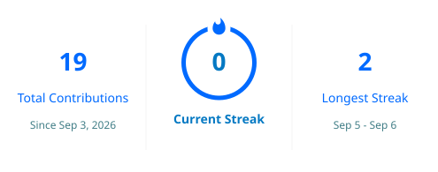

# 👋 Hi, I'm Rushikesh Ighewad

### 🚀 Aspiring Data & AI Professional

**📊 Data Analytics • 🧠 Data Science • ☁️ Cloud • 🤖 Generative AI**

*Turning data into insights and ideas into real-world solutions.*

---

## 👨‍💻 About Me

Hi! I'm **Rushikesh**, an aspiring **Data & AI Professional** passionate about exploring technology, solving practical problems, and building real-world projects.

- 📊 Exploring **Data Analytics & Data Science**
- 🐍 Working with **Python, SQL & Data Science libraries**
- 📈 Creating dashboards using **Excel, Power BI & Tableau**
- 🌐 Building projects with **HTML, CSS & JavaScript**
- ☁️ Exploring **Cloud Computing & AWS**
- 🤖 Learning and experimenting with **Generative AI**
- 📖 Exploring the possibilities of **Narrative AI**
- 🚀 Learning by building and continuously improving

> 💡 My goal is to combine **Data, Technology and AI** to build useful and meaningful solutions.

---

## 🛠️ Tech Stack

### 💻 Programming & Web

### 📊 Data Analytics & Visualization

### 🧮 Python Data Science

### ☁️ Cloud & Development Tools

---

## 🚀 Featured Projects

<table>
<tr>

<td width="50%" valign="top">

### 🛒 E-Commerce Analytics

#### 📊 Sales & Customer Analytics

End-to-end analytics project focused on **sales performance, customer behavior, product trends and business insights** using real-world data.

**Tech Stack**

`Python` `SQL` `Pandas` `Power BI` `Tableau` `Excel`

**Highlights**
- 📈 Sales & revenue analysis
- 👥 Customer behavior analysis
- 🛍️ Product & category performance
- 💡 Business insights & recommendations

https://github.com/RUSHIKESH-2005-PY/E-Commerce-Sales-Customer-Analytics

</td>
<td width="50%" valign="top">

### 🧠 Data Science

🚧 **Coming Soon**

Machine learning and data science projects focused on extracting patterns, predictions and insights from data.

</td>

</tr>

<tr>

<td width="50%" valign="top">

### ☁️ Cloud Computing

🚧 **Coming Soon**

Hands-on cloud projects exploring AWS and practical cloud-based solutions.

</td>

<td width="50%" valign="top">

### 🤖 Generative AI

🚧 **Coming Soon**

Exploring intelligent applications and real-world solutions powered by Generative AI.

</td>

</tr>

<tr>

<td width="50%" valign="top">

### 📖 Narrative AI

🚧 **Coming Soon**

Exploring AI-powered storytelling, data narratives and meaningful user experiences.

</td>

<td width="50%" valign="top">

### 🔮 More Coming Soon...

Building, experimenting and expanding my portfolio one project at a time.

</td>

</tr>
</table>

## 📚 Currently Learning

| Area | Focus |
|---|---|
| 📊 Data Analytics | Excel • SQL • Power BI • Tableau |
| 🐍 Python | NumPy • Pandas • Matplotlib • Seaborn |
| 🧠 Data Science | Statistics • Machine Learning |
| ☁️ Cloud | AWS • Cloud Fundamentals |
| 🤖 Generative AI | AI Applications • LLMs |
| 📖 Narrative AI | Data Storytelling • AI-powered Narratives |

---

## 🧭 My Journey

**📊 Data Analytics**  
↓  
**🧠 Data Science**  
↓  
**☁️ Cloud Computing**  
↓  
**🤖 Generative AI**  
↓  
**📖 Narrative AI**  
↓  
**🚀 Building Real-World Solutions**

---

## 📊 GitHub Stats

 

## 🐍 Contribution Journey

<picture>
  <source media="(prefers-color-scheme: dark)" srcset="https://raw.githubusercontent.com/RUSHIKESH-2005-PY/RUSHIKESH-2005-PY/output/github-contribution-grid-snake-dark.svg">
  <source media="(prefers-color-scheme: light)" srcset="https://raw.githubusercontent.com/RUSHIKESH-2005-PY/RUSHIKESH-2005-PY/output/github-contribution-grid-snake.svg">
  
</picture>

## 💻 What I'm Building

| 📊 Data | 🧠 AI | ☁️ Cloud |
|:---:|:---:|:---:|
| Analytics | Data Science | AWS |
| Visualization | Generative AI | Cloud Projects |
| Business Insights | Narrative AI | Cloud Solutions |

---
---

## 📊 Skill Radar

<table>
<tr>
<td align="center" width="50%">

### 🐍 Programming

**Python**  
████████████████░░░░ 80%

**SQL**  
███████████████░░░░░ 75%

**HTML / CSS**  
██████████████░░░░░░ 70%

**JavaScript**  
████████████░░░░░░░░ 60%

</td>

<td align="center" width="50%">

### 📈 Analytics

**Excel**  
████████████████░░░░ 80%

**Power BI**  
███████████████░░░░░ 75%

**Tableau**  
██████████████░░░░░░ 70%

**Data Visualization**  
███████████████░░░░░ 75%

</td>
</tr>

<tr>
<td align="center">

### 🧠 Data Science

**Pandas**  
███████████████░░░░░ 75%

**NumPy**  
██████████████░░░░░░ 70%

**Matplotlib**  
██████████████░░░░░░ 70%

**Seaborn**  
██████████████░░░░░░ 70%

</td>

<td align="center">

### ☁️ Tools & Cloud

**Git / GitHub**  
███████████████░░░░░ 75%

**AWS**  
███████████░░░░░░░░░ 55%

**VS Code**  
████████████████░░░░ 80%

**Data + AI Projects**  
████████████░░░░░░░░ 60%

</td>
</tr>
</table>

## 🎯 2026 Goals

- ✅ Build a strong GitHub portfolio
- 🔄 Complete real-world Data Analytics projects
- 🔄 Build Data Science & Machine Learning projects
- 🔄 Develop practical Cloud projects
- 🔄 Explore Generative AI
- 🔄 Explore Narrative AI
- 🔄 Build a professional portfolio website
- 🎯 Become **job-ready**

---

## 🤝 Let's Connect

 

### 💡 Learn • Build • Experiment • Grow

**Thanks for visiting my profile! 🚀**

